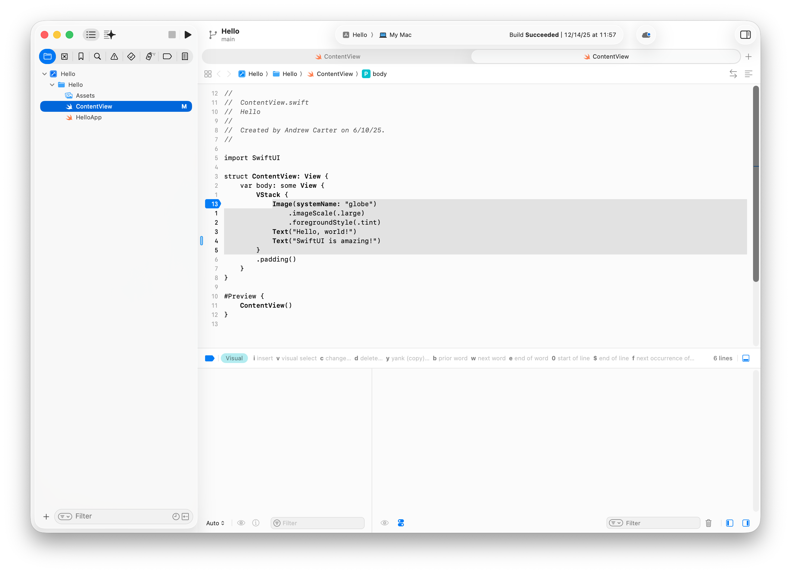

# xcode-alpental-theme

Alpental theme for Xcode.

This repo contains pre-generated Xcode color themes (`.xccolortheme`) and the source used to generate them.




## Themes

The generated themes live in `themes/`:

- `Alpental Dark.xccolortheme`
- `Alpental Light.xccolortheme`

## Install in Xcode

Xcode loads user themes from:

- `~/Library/Developer/Xcode/UserData/FontAndColorThemes/`

### Install via `just` (recommended)

From the repo root:

`just install`

Then restart Xcode and select the theme:

- **Xcode → Settings… → Themes** (or **Preferences…** on older Xcode)
- Pick **Alpental Dark** or **Alpental Light**

### Install the pre-generated themes manually

1. Create the Xcode themes directory (if it doesn’t exist):

   - `~/Library/Developer/Xcode/UserData/FontAndColorThemes/`

2. Copy the `.xccolortheme` files from this repo’s `themes/` folder into that directory.

3. Restart Xcode.

4. Select the theme in Xcode:

   - **Xcode → Settings… → Themes** (or **Preferences…** on older Xcode)
   - Pick **Alpental Dark** or **Alpental Light**

### Install by double-clicking

In Finder, you can usually install a theme by double-clicking the `.xccolortheme` file (Xcode should import it). If that doesn’t work reliably, use Option A or B.

## Build (regenerate themes)

This repo can regenerate the themes from `src/` using `veneer`.

### Prerequisites

- Install the [veneer-theme](https://github.com/ascarter/veneer-theme) CLI used to build the theme assets:
  ```sh
  cargo install --git https://github.com/ascarter/veneer-theme
  ```
- Install [just](https://just.systems) for running the task recipes:
  ```sh
  brew install just
  ```

### Build

From the repo root:

- `just build`

This will (re)generate `.xccolortheme` files into `themes/`.

### Install (copy into Xcode theme directory)

- `just install`

### Clean

- `just clean`

## License

See `LICENSE`.
